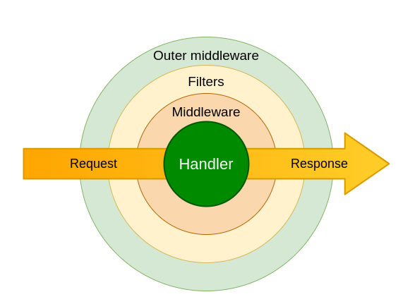

Сейчас мы немного поговорим о таком понятии как middleware
Middleware - это словно мост, связывающий между собой две части программы или системы.
Задача мидлвари вклиниваться в процесс обработки апдейтов для реализации какой-либо логики.

Что можно делать внутри мидлварей:

логировать события;

передавать в хэндлеры какие-то объекты (например, сессию базы данных из пула сессий);

подменять обработку апдейтов, не доводя до хэндлеров;

по-тихому пропускать апдейты, как будто их и не было;

и т.п

Воспользуемся схемой из официальной документации

Мидлварей два вида: внешние (outer) и внутренние (inner или просто «мидлвари»). 
В чём разница? Outer выполняются до начала проверки фильтрами, в inner — после. 
На практике это значит, что апдейт/сообщение/колбэк, проходящий через outer-мидлварь, 
может так ни в один хэндлер и не попасть, а если он попал в inner, то дальше 100% будет какой-то хэндлер.
Мидлварь обязательно должна быть унаследована от BaseMiddleware

Все методы для точек взаимодействия должны иметь названия:

on_<point>_<event_type>,
То есть on_pre_process_message, on_post_process_update

Каждая мидлварь, построенная на классах (впрочем, возможны и иные варианты), должна реализовывать метод __call__() 
с тремя аргументами:

handler — собственно, объект хэнлдлера, который будет выполнен. Имеет смысл только для inner-мидлварей, 
т.к. outer-мидлварь ещё не знает, в какой хэндлер попадёт апдейт.

event — тип Telegram-объекта, который обрабатываем. Обычно это Update, Message, CallbackQuery или InlineQuery 
(но не только). Если точно знаете, какого типа объекты обрабатываете, смело пишите, например, Message вместо TelegramObject.

data — связанные с текущим апдейтом данные: FSM, переданные доп. поля из фильтров, флаги (о них позже) 
и т.д. В этот же data мы можем класть из мидлварей какие-то свои данные, которые будут доступны в виде аргументов 
в хэндлерах (так же, как в фильтрах).

С телом функции ещё интереснее.

Всё, что вы напишете до строки:\
result = await handler(event, data)\
будет выполнено до передачи управления нижестоящему обработчику (это может быть другая мидлварь или непосредственно хэндлер).

Всё, что вы напишете после строки:\
result = await handler(event, data)\
будет выполнено уже после выхода из нижестоящего обработчика.

Если вы хотите, чтобы обработка продолжилась, вы должны вызвать await handler(event, data). Если хотите «дропнуть» апдейт, 
просто не вызывайте его.

Если вам не интересно, что происходит после выполнения функции handler(...), можно сделать return await handler(event, 
data) и выйти из функции __ call __().

Все привычные нам объекты (Message, и т.д.) являются апдейтами (Update), поэтому для Message сначала выполнятся мидлвари
для Update, а уже затем для самого Message. Оставим на месте наши print() из примера выше и проследим, 
как будут выполняться мидлвари, если мы зарегистрируем по одной outer- и inner-мидлвари для типов Update и Message.

Есть несколько точек, куда мидлварью можно вклиниваться:
- pre_process: выполняется каждый раз перед началом фильтрации
- process: выполняется каждый раз после прохождения фильтра перед запуском хендлера
- post_process: выполняется каждый раз после обработки всего

Если сообщение (Message) в конечном счёте обработалось каким-то хэндлером:
- [Update Outer] Before handler
- [Update Inner] Before handler
- [Message Outer] Before handler
- [Message Inner] Before handler
- [Message Inner] After handler
- [Message Outer] After handler
- [Update Inner] After handler
- [Update Outer] After handler

Если сообщение не нашло нужный хэндлер:
- [Update Outer] Before handler
- [Update Inner] Before handler
- [Message Outer] Before handler
- [Message Outer] After handler
- [Update Inner] After handler
- [Update Outer] After handler
